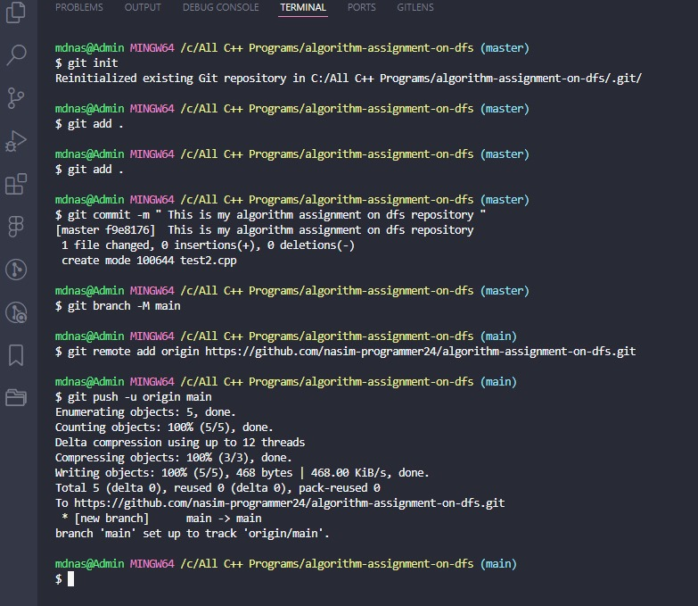

# Depth First Search (DFS) Algorithm

## Algorithm Steps

- Include Libraries: The necessary C++ standard library is included.
- Constants and Variables Declaration:
- maxNodesNumber: Maximum number of nodes in the graph.
- visited[maxNodesNumber]: Boolean array to mark visited nodes.
- graph[maxNodesNumber][maxNodesNumber]: Adjacency matrix representing the graph.
- Prompts the user for the beginning node.
- Validates input and calls the dfs function.
- Begins DFS from the specified starting node.
- Prints visited nodes during traversal.
- Explore the neighbors of the start node.
- If there are undiscovered neighbor nodes, switch to that node and repeat the steps recursively.
- When there are no undiscovered neighbor nodes, go back and return to the previous node.
- Repeat the steps until all nodes have been visited.
- End of Program: Returns 0 upon successful execution.

## Graph Picture

## Program Output

## Git Commands

